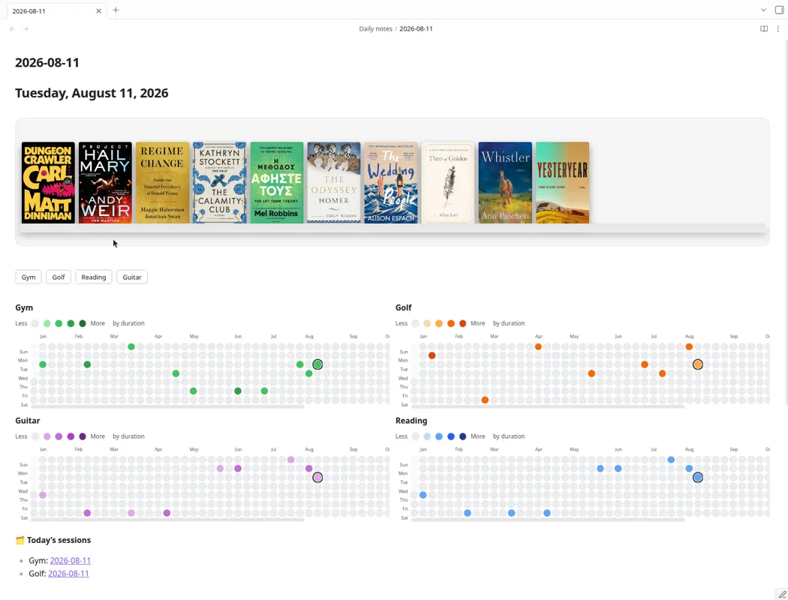

# Atomic

Habit tracking in Obsidian. Sessions, reading, heatmaps, one daily note.

**Install:** download `obsidian-atomic-*.zip` from the latest [GitHub Release](https://github.com/justinw0ng/obsidian-atomic/releases) and unzip into `<vault>/.obsidian/plugins/` (so you get `obsidian-atomic/main.js`, `manifest.json`, and `styles.css`).

**Guide:** [docs/USER_GUIDE.md](docs/USER_GUIDE.md)



## What it does

- Exercise sessions and custom habits: enable/disable, one color picker → four heatmap shades
- Reading items with timers, book shelf, and Bases bookshelf
- Heatmaps filterable with `activity: …`, optional 2×2 grid (`columns`, `rows`, …)
- Property dropdowns for Reading `status`, golf `felt`/`location`, gym `location`/`weight_unit` (`location` also allows Custom…)

Settings → Atomic → Language: Traditional Chinese & English (`zh-Hant-en`, default) or English (`en`). Changing language never rewrites existing notes.

## Default vault layout

```text
atomics/
├── Dashboard.md
├── exercise/
│   ├── Gym/
│   │   ├── Cues.md
│   │   └── YYYY/YYYY-MM-DD.md
│   └── Golf/
│       ├── Cues.md
│       └── YYYY/YYYY-MM-DD.md
└── hobbies/
    └── Reading/
        ├── Bookshelf.base
        ├── Book Shelf.md
        ├── Covers/
        └── Items/<Book>.md
```

## Upgrade from Fitness

**Settings → Atomic → Migrate from Fitness to Atomic** moves legacy paths when the Atomic destination is empty, rewrites `fitness-*` fences to `atomic-*`, updates settings, and turns off legacy aliases. Details: [docs/USER_GUIDE.md#upgrade-from-fitness](docs/USER_GUIDE.md#upgrade-from-fitness).
