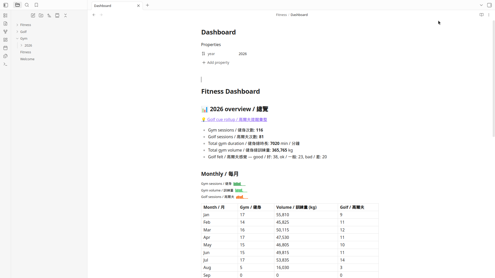
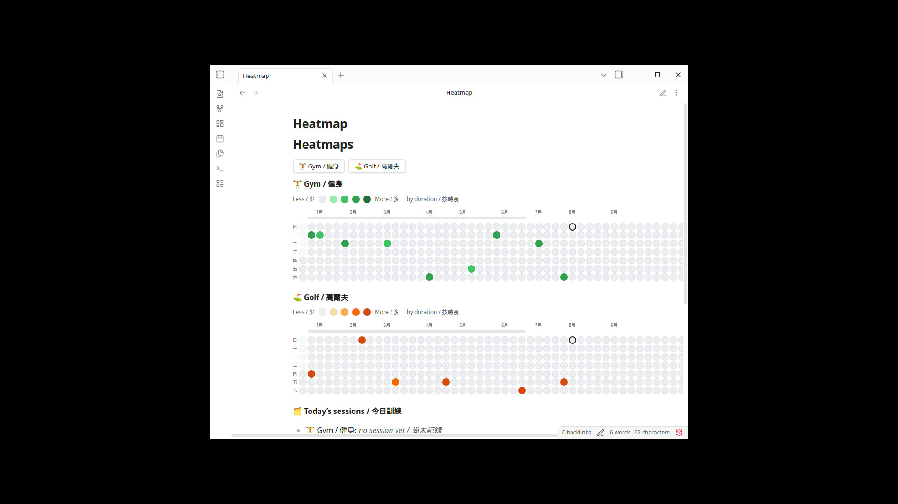

# Fitness

Obsidian plugin for gym and golf sessions — heatmaps, yearly dashboard, golf and gym cue rollups (`fitness-golf-cues`, `fitness-gym-cues`), and quick session creation.

**Install:** download `obsidian-atomic-*.zip` from the latest [GitHub Release](https://github.com/justinw0ng/fitness-plugin/releases) and unzip it into `<vault>/.obsidian/plugins/` (so you get `obsidian-atomic/main.js`, `manifest.json`, and `styles.css`).

**Setup guide:** [docs/USER_GUIDE.md](docs/USER_GUIDE.md)

## Dashboard

## Quick actions, heatmap, and today

