# Atomic plugin — user guide

Step-by-step setup for the Obsidian Atomic plugin: gym and golf sessions, Reading timers, heatmaps, dashboard, cue rollups, and bookshelf views under `atomics/**`.

Screenshots live in [`docs/images/`](./images/). Captured on Linux with Obsidian in Light mode; macOS and Windows look the same aside from window chrome.

---

## What you get

| Feature | How you use it |
|---------|----------------|
| Year heatmaps | `atomic-heatmap` codeblock |
| Today’s sessions | `atomic-today` codeblock |
| Yearly dashboard | `atomic-dashboard` codeblock |
| Golf cue rollup | `atomic-golf-cues` (legacy: `fitness-golf-cues`, `fitness-cues`) |
| Gym cue rollup | `atomic-gym-cues` (legacy: `fitness-gym-cues`) |
| Generic cue rollup | `atomic-cues` with `activity: golf` or `activity: gym` |
| Quick actions | `atomic-actions`, or the command palette |
| New gym / golf notes | **Atomic: New gym session** / **New golf session** |
| Reading items | **Atomic: New reading item** |
| Reading timer | `atomic-timer` in a Reading item note |
| Reading notes in Bases | **Atomic: Open reading notes in Bases** |
| Book shelf | `atomic-bookshelf`, or **Atomic: Open book shelf** |

Session data is plain markdown in your vault. Nothing is sent over the network.

Rendered views (heatmap, dashboard, book shelf, timer, cues) do not show an “Atomic …” heading above the UI. The plugin name stays in Settings and in command palette prefixes only.

---

## Upgrade from Fitness

If you already use an older Fitness install, upgrade like this:

1. Install Atomic into `<vault>/.obsidian/plugins/obsidian-atomic/` (see [Install](#4-install-this-plugin-into-the-vault)). You can keep the old `obsidian-fitness` folder until migration finishes, then remove it.
2. Enable **Atomic** under Community plugins. Disable the old Fitness plugin if both are listed.
3. Open **Settings → Atomic**.
4. Leave **Allow legacy `fitness-*` blocks** on until you migrate.
5. Click **Migrate from Fitness to Atomic**. That will:
   - move `Fitness/Dashboard.md`, `Gym/`, and `Golf/` into `atomics/**` when the destination is empty (skip if the destination already exists; no merge)
   - rewrite top-level `fitness-*` code fences to `atomic-*`
   - update settings paths and turn legacy aliases off
6. Reload the plugin or Obsidian so registered processors match the new settings.
7. Open your dashboard and cue notes once to confirm the new fences render.

Fresh installs can skip this section and start under `atomics/**`.

---

## 1. Install Obsidian

1. Download Obsidian from [obsidian.md/download](https://obsidian.md/download).
2. Install for your OS.
3. Launch Obsidian.

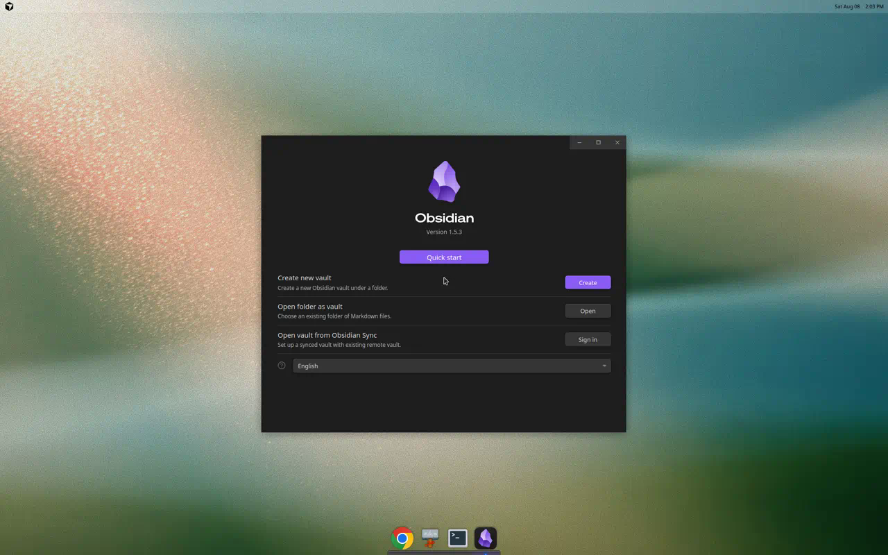

---

## 2. Create or open a vault

1. Choose **Create new vault** (or open an existing one).
2. Name it (example: `Atomic Demo`).
3. Pick a folder on disk and create it.

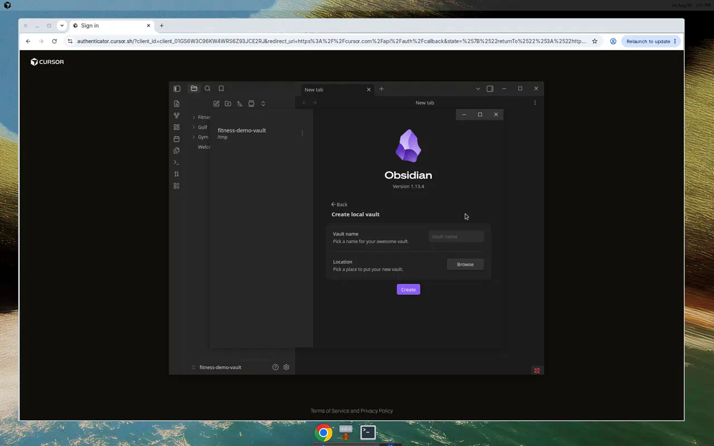

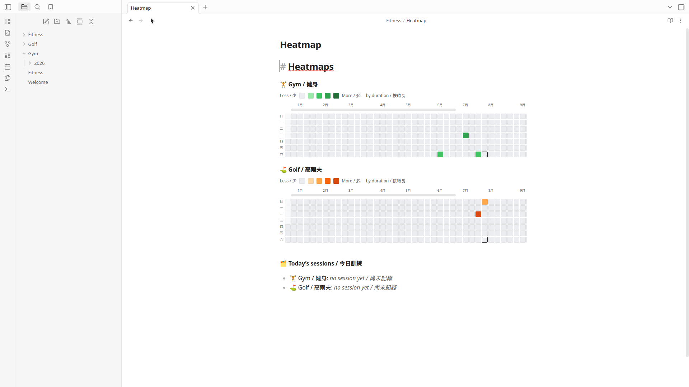

---

## 3. Turn on community plugins

1. Open **Settings** (gear icon, or `Ctrl/Cmd + ,`).
2. Go to **Community plugins**.
3. If you see **Restricted mode**, turn it off.
4. Confirm any trust prompt for your vault.

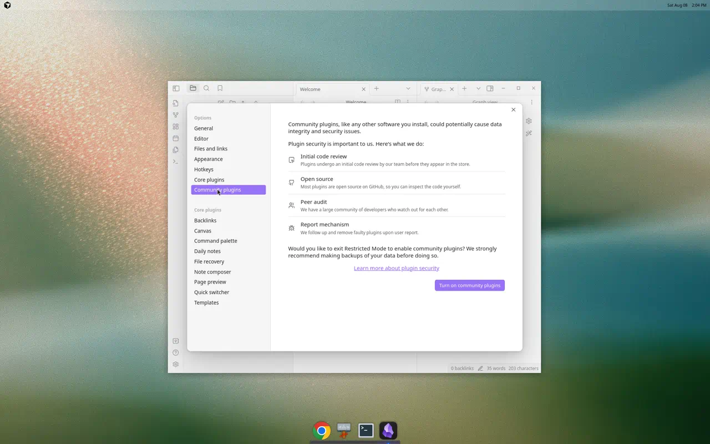

---

## 4. Install this plugin into the vault

Installed from GitHub Releases (not yet from the Community Plugin browser).

### Option A — Download a release (recommended)

1. Open the latest [GitHub Release](https://github.com/justinw0ng/obsidian-atomic/releases).
2. Download `obsidian-atomic-<version>.zip`.
3. Unzip into your vault’s plugins folder:

```text
<vault>/.obsidian/plugins/
```

That creates `<vault>/.obsidian/plugins/obsidian-atomic/` with `main.js`, `manifest.json`, and `styles.css`.

### Option B — Build from source

```bash
npm install
npm run build
```

Copy `main.js`, `manifest.json`, and `styles.css` into `<vault>/.obsidian/plugins/obsidian-atomic/`.

Optional one-shot copy while building:

```bash
OBSIDIAN_PLUGIN_OUT=/path/to/vault/.obsidian/plugins/obsidian-atomic npm run build
```

### Option C — Symlink (good for development)

```bash
mkdir -p /path/to/vault/.obsidian/plugins
ln -sfn "$(pwd)" /path/to/vault/.obsidian/plugins/obsidian-atomic
npm run build
```

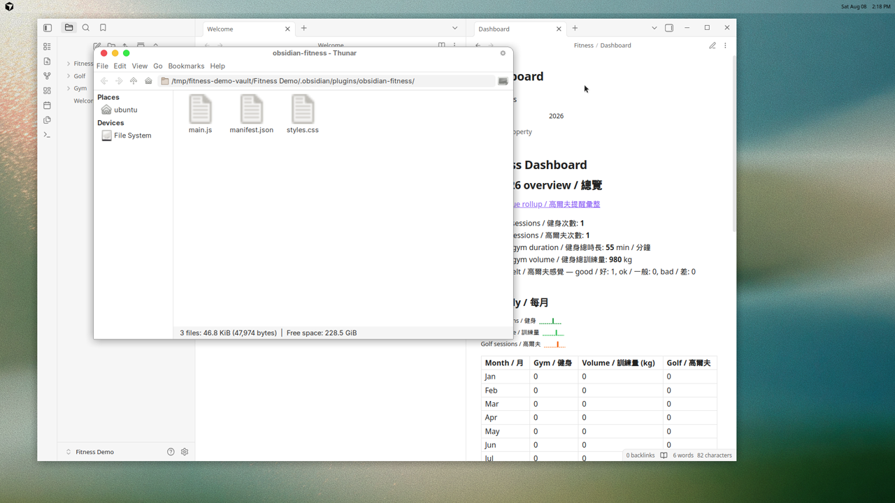

The screenshot may show a demo path under `/tmp/...`. On your machine use `<your-vault>/.obsidian/plugins/obsidian-atomic/` with the same three files.

---

## 5. Enable Atomic

1. **Settings → Community plugins**.
2. Click **Reload plugins** if the list is stale.
3. Find **Atomic** and toggle it on.

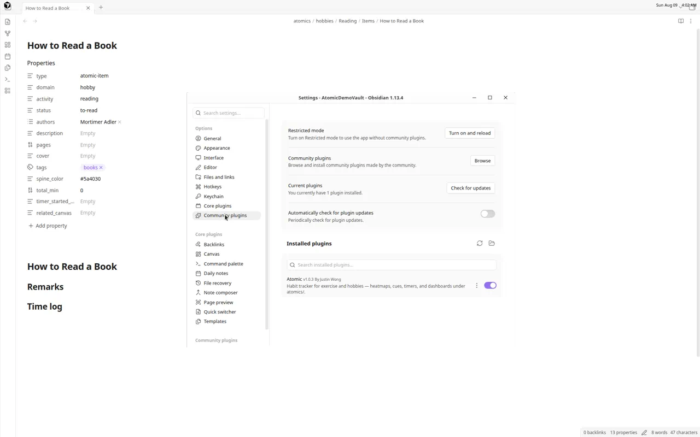

---

## 6. Configure settings

**Settings → Atomic**:

| Setting | Default | Purpose |
|---------|---------|---------|
| Language | Traditional Chinese & English (`zh-Hant-en`) | Plugin UI language. Options are Traditional Chinese & English or English; existing notes are not rewritten |
| Timezone | `Asia/Hong_Kong` | “Today” and new session dates |
| Dashboard path | `atomics/Dashboard.md` | Target of **Open dashboard** |
| Exercise types | Gym, Golf | Enable/disable, label, folder, cues, **one color**, delete; add custom exercises |
| General habits | Reading | Enable/disable, label, folder, **one color**, delete; add custom item+timer habits |
| Allow legacy `fitness-*` blocks | On | Keep old Fitness codeblock names until migration |
| Migrate from Fitness to Atomic | (button) | One-click vault + fence migrate (see [Upgrade from Fitness](#upgrade-from-fitness)) |

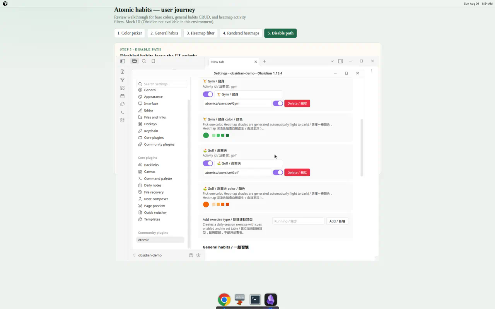

> Screenshot from the settings mockup (`docs/mockups/atomic/01-settings.html`) because Obsidian desktop is not available in the docs VM. In the live plugin each row uses Obsidian’s color picker plus enable/delete controls.

Each habit has a single color picker. Atomic derives the four heatmap shades (light → dark) automatically; a small swatch row previews them. Disable a habit to hide it from heatmaps, dashboard, and commands without deleting vault notes. Delete removes it from settings only (Reading is not force-added back afterward).

Exercise folders default to `atomics/exercise/Gym` and `atomics/exercise/Golf`. Reading defaults to `atomics/hobbies/Reading` with item notes under `Items/`.

Language only changes plugin chrome, prompts, notices, command names after reload, and templates created after the change. There is no Simplified Chinese or Chinese-only mode.

---

## 7. Recommended vault layout

```text
Vault/
├── atomics/
│   ├── Dashboard.md
│   ├── exercise/
│   │   ├── Gym/
│   │   │   ├── Cues.md
│   │   │   └── YYYY/
│   │   │       └── YYYY-MM-DD.md
│   │   └── Golf/
│   │       ├── Cues.md
│   │       └── YYYY/
│   │           └── YYYY-MM-DD.md
│   └── hobbies/
│       └── Reading/
│           ├── Bookshelf.base
│           ├── Book Shelf.md
│           ├── Covers/
│           │   └── title.jpg
│           └── Items/
│               └── Atomic Habits.md
└── .obsidian/plugins/obsidian-atomic/
    ├── main.js
    ├── manifest.json
    └── styles.css
```

### Dashboard note example

`atomics/Dashboard.md`:

````markdown
---
year: 2026
---

# Atomic Dashboard

```atomic-dashboard
year: 2026
```
````

### Heatmap note example

````markdown
# Heatmaps

```atomic-actions
```

```atomic-heatmap
year: 2026
```

```atomic-today
```
````

`atomic-heatmap` shows **all enabled** habits by default. Narrow it with `activity:`:

````markdown
```atomic-heatmap
activity: reading
year: 2026
```

```atomic-heatmap
activity: gym, golf
year: 2026
```
````

Use `activity: all` (or omit the field) for every enabled exercise + general habit. Unknown or disabled ids show a short notice; valid ids in the list still render.

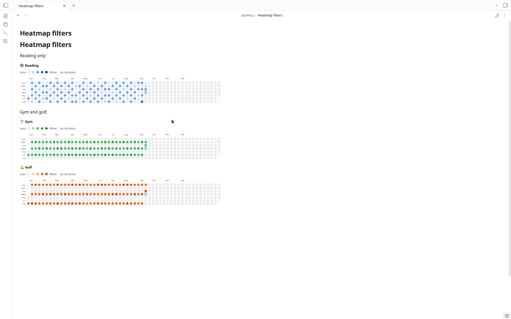

### Cue note examples

`atomics/exercise/Golf/Cues.md`:

````markdown
# Golf Cues

```atomic-golf-cues
year: 2026
```
````

`atomics/exercise/Gym/Cues.md`:

````markdown
# Gym Cues

```atomic-gym-cues
year: 2026
```
````

Legacy names `fitness-heatmap`, `fitness-today`, `fitness-dashboard`, `fitness-actions`, `fitness-golf-cues`, `fitness-gym-cues`, and `fitness-cues` still work while **Allow legacy `fitness-*` blocks** is on.

---

## 8. Create your first sessions

### From the command palette

1. `Ctrl/Cmd + P`
2. Run **Atomic: New gym session** or **Atomic: New golf session**
3. Enter the date, then follow location / unit prompts for gym

### From the actions codeblock

Put `atomic-actions` on a note and use the buttons.

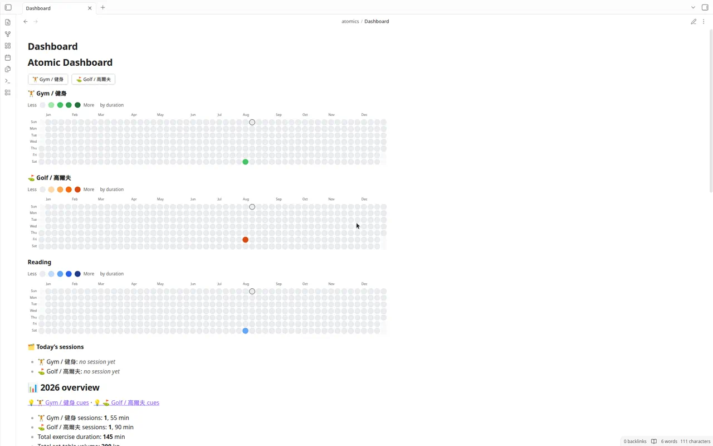

Gym notes store sets in a markdown table and reminders under a **Reminders** heading. Golf notes store reminders under **Reminders**. Those feed the cue rollups.

---

## 9. Track Reading and other general habits

Reading is the default general habit (item notes + timer). You can disable or delete it in settings, and add other general habits the same way (for example Chess under `atomics/hobbies/Chess`).

### Create a book or hobby item

1. Run **Atomic: New reading item** (Reading only), or **Atomic: New hobby item** and pick an enabled general habit.
2. Enter the item title.
3. Atomic creates or opens `<hobby-folder>/Items/<Title>.md`.

Frontmatter is ready for Bases:

```yaml
type: atomic-item
domain: hobby
activity: reading
status: to-read
authors:
  - ""
description: ""
pages:
cover: "[[atomics/hobbies/Reading/Covers/title.jpg]]"
tags:
  - books
spine_color:
total_min: 0
timer_started_at:
related_canvas:
```

`cover` accepts a vault wikilink, vault-relative path, or `http(s):` / `app://` image URL. Put local art under `atomics/hobbies/Reading/Covers/` (or any vault path). Empty `cover` uses `spine_color` / a hashed color with the title (long titles wrap and shrink on the shelf).

Use **Remarks** for notes. **Time log** is managed by the timer.

### Use the timer

Reading item notes include:

````markdown
```atomic-timer
```
````

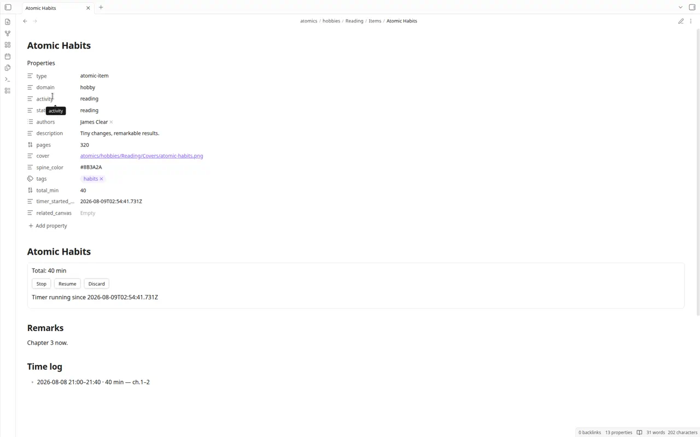

In Reading view, use **Start**, **Stop**, **Resume**, or **Discard**. Stop clears `timer_started_at`, increments `total_min`, and appends a time-log bullet. Timer-log minutes feed `atomic-heatmap` and the dashboard hobby section.

### Open the Reading bookshelf (Bases)

Run **Atomic: Open reading notes in Bases**. Atomic creates `atomics/hobbies/Reading/Bookshelf.base` if missing, then opens it. The file seeds Bases Cards and Table views for Reading items.

Soft-requires Obsidian’s **Bases** core plugin. If Bases is disabled, Atomic shows a notice and leaves the vault unchanged.

### Open the book shelf

Run **Atomic: Open book shelf**. Atomic creates `atomics/hobbies/Reading/Book Shelf.md` if missing:

````markdown
```atomic-bookshelf
activity: reading
```
````

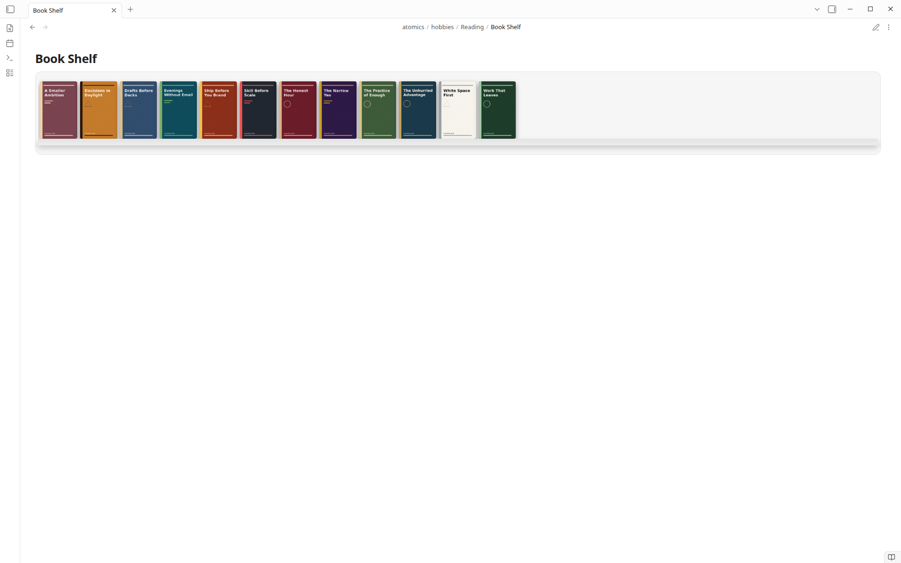

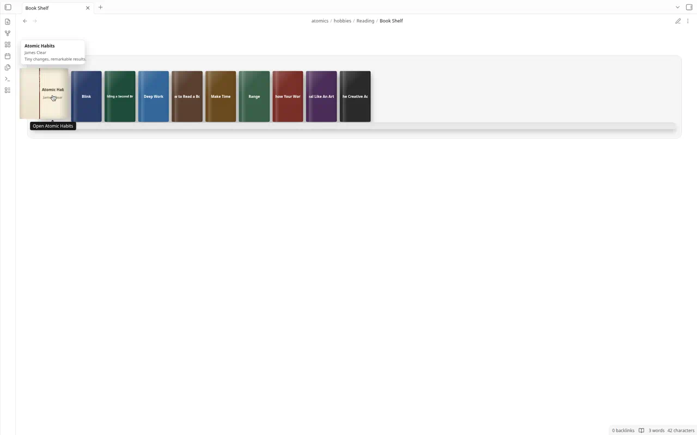

The shelf is a plugin-rendered scene with no heading above the books. Books stand on planks; editor width decides how many books sit on each plank (rows reflow on resize). Hover/focus rolls the cover open on a spine hinge (local CSS 3D). Click opens the book note. No Framer runtime.

#### Set a custom book cover

By default an empty `cover` field shows a colored spine with the title. To use your own art on the Atomic book shelf (and in Bases Cards when the view uses `cover`):

1. Add an image to the vault. Recommended folder: `atomics/hobbies/Reading/Covers/` (create it if missing). Example: `atomics/hobbies/Reading/Covers/atomic-habits.jpg`.
2. Open the book item note (for example `atomics/hobbies/Reading/Items/Atomic Habits.md`).
3. In Properties / frontmatter, set `cover` to one of:
   - Vault wikilink: `[[atomics/hobbies/Reading/Covers/atomic-habits.jpg]]`
   - Vault-relative path: `atomics/hobbies/Reading/Covers/atomic-habits.jpg`
   - Remote or app URL: `https://…` or `app://…`
4. Save the note, then reopen or refresh **Book Shelf** (`atomic-bookshelf`) so the cover image loads on the book face.

Optional: set `spine_color` to a hex color (for example `#7c3aed`) when you want a custom spine without a cover image. If both are set, `cover` wins for the book face.

`related_canvas` is a plain frontmatter field. Drag Reading notes onto Obsidian Canvas or link them with normal wikilinks.

---

## 10. Use the views

Open your dashboard or heatmap note. Codeblocks render in Reading view.

### `atomic-dashboard`

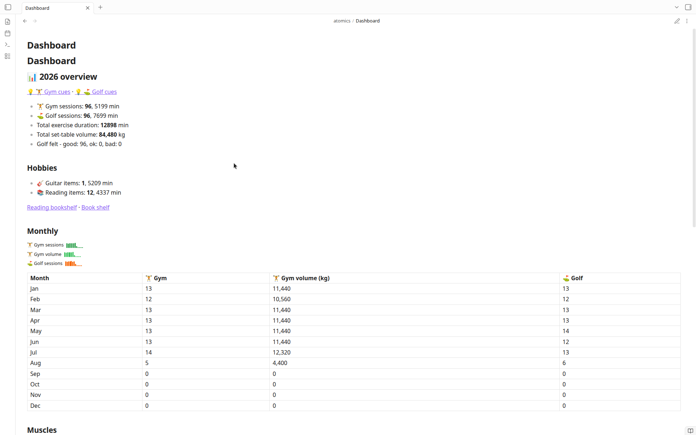

### `atomic-heatmap`

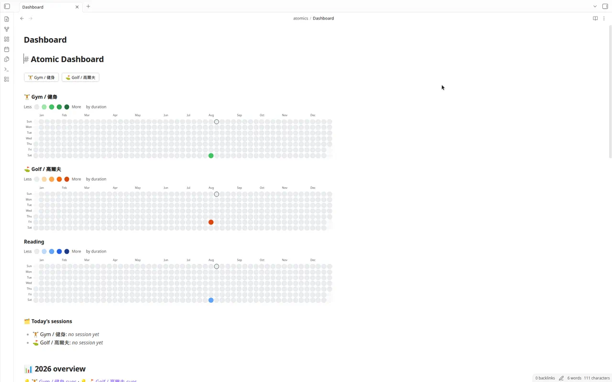

Optional YAML inside a codeblock body:

```text
year: 2026
activity: all
```

`activity` accepts `all`, one activity id (`reading`, `gym`, …), or a comma-separated list (`gym, golf, reading`).

For today blocks:

```text
date: 2026-08-08
```

---

## 11. Commands reference

| Command | Action |
|---------|--------|
| Atomic: New gym session | Create or open `atomics/exercise/Gym/YYYY/YYYY-MM-DD.md` (Gym must be enabled) |
| Atomic: New golf session | Create or open `atomics/exercise/Golf/YYYY/YYYY-MM-DD.md` (Golf must be enabled) |
| Atomic: New exercise session | Pick an enabled exercise type, then create/open its daily note |
| Atomic: New reading item | Create or open `atomics/hobbies/Reading/Items/<Book>.md` (Reading must be enabled) |
| Atomic: New hobby item | Pick an enabled general habit, then create/open an item note |
| Atomic: Ensure reading bookshelf | Create `atomics/hobbies/Reading/Bookshelf.base` if missing |
| Atomic: Open reading notes in Bases | Ensure and open `atomics/hobbies/Reading/Bookshelf.base` |
| Atomic: Ensure book shelf | Create `atomics/hobbies/Reading/Book Shelf.md` if missing |
| Atomic: Open book shelf | Ensure and open `atomics/hobbies/Reading/Book Shelf.md` |
| Atomic: Open dashboard | Open the configured dashboard path |

---

## Troubleshooting

| Problem | Fix |
|---------|-----|
| Plugin not listed | Confirm files are under `.obsidian/plugins/obsidian-atomic/` and reload plugins |
| Restricted mode | Turn on community plugins in Settings |
| Empty heatmap / dashboard | Enable the habit in settings; add exercise sessions with `date` / duration, or stop a hobby timer so the item has Time log entries |
| Heatmap says unknown/disabled activities | Fix `activity:` ids, or re-enable the habit in Settings → Atomic |
| Reading notes in Bases do not open | Enable Reading in settings, enable Bases, then rerun **Atomic: Open reading notes in Bases** |
| Wrong “today” | Set **Timezone** in Atomic settings to your IANA zone |
| Codeblock shows raw text | Enable the plugin and use Reading view (or Live Preview after reload) |
| Still seeing `fitness-*` fences | Run **Migrate from Fitness to Atomic**, or rewrite fences by hand and turn legacy aliases off |

---

## Privacy

- All data stays in your vault as markdown.
- The plugin does not make network requests.
- Build deploy to a vault happens only if you set `OBSIDIAN_PLUGIN_OUT` yourself.
