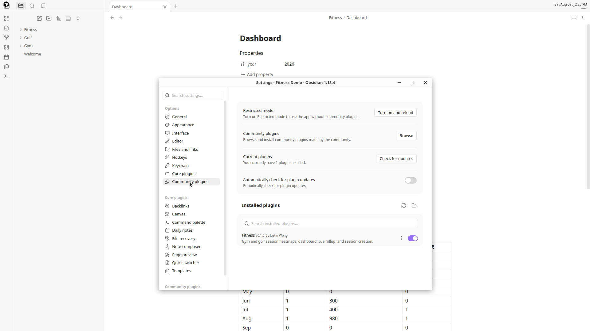
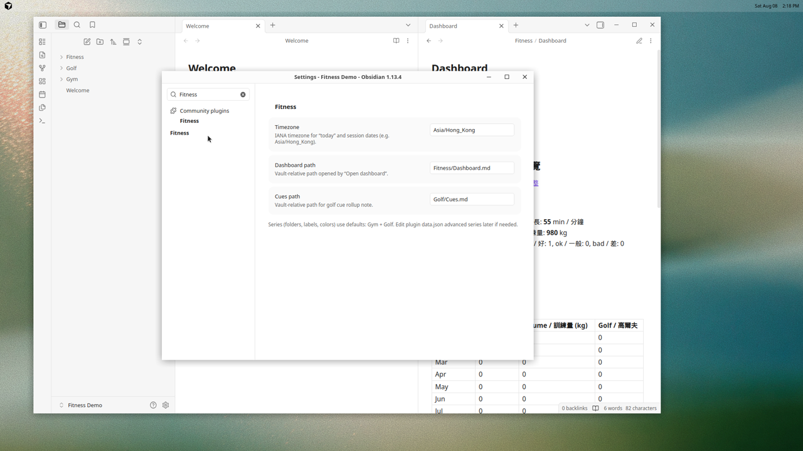

# Atomic plugin — user guide

Step-by-step setup for the Obsidian **Atomic** plugin: gym and golf session notes, Reading item timers, heatmaps, dashboard, cue rollups, and bookshelf views under `atomics/**`.

Screenshots live in [`docs/images/`](./images/). They were captured on Linux with Obsidian; macOS and Windows look the same aside from window chrome.

---

## What you get

| Feature | How you use it |
|---------|----------------|
| Year heatmaps | `atomic-heatmap` codeblock |
| Today’s sessions | `atomic-today` codeblock |
| Yearly dashboard | `atomic-dashboard` codeblock |
| Golf cue rollup | `atomic-golf-cues` codeblock (legacy aliases: `fitness-golf-cues`, `fitness-cues`) |
| Gym cue rollup | `atomic-gym-cues` codeblock (legacy alias: `fitness-gym-cues`) |
| Generic cue rollup | `atomic-cues` codeblock with `activity: golf` or `activity: gym` |
| Quick actions | `atomic-actions` codeblock, or command palette |
| New gym / golf notes | Commands **Atomic: New gym session** / **New golf session** |
| Reading items | Command **Atomic: New reading item** |
| Reading timer | `atomic-timer` codeblock in a Reading item note |
| Reading Bases bookshelf | Command **Atomic: Open reading bookshelf** |
| Atomic book shelf | `atomic-bookshelf` codeblock, or command **Atomic: Open book shelf** |

Session data is plain markdown in your vault. Nothing is sent over the network.

---

## 1. Install Obsidian

1. Download Obsidian from [obsidian.md/download](https://obsidian.md/download).
2. Install for your OS (Installer on macOS/Windows, AppImage or deb on Linux).
3. Launch Obsidian.


---

## 2. Create or open a vault

1. Choose **Create new vault** (or open an existing one).
2. Name it (example: `Atomic Demo`).
3. Pick a folder on disk and create it.


---

## 3. Turn on community plugins

Local plugins load through the Community plugins system.

1. Open **Settings** (gear icon, or `Ctrl/Cmd + ,`).
2. Go to **Community plugins**.
3. If you see **Restricted mode**, turn it **off** / click **Turn on community plugins**.
4. Confirm any trust prompt for your vault.


---

## 4. Install this plugin into the vault

This plugin is installed from GitHub Releases (not yet from the Community Plugin browser).

### Option A — Download a release (recommended)

1. Open the latest [GitHub Release](https://github.com/justinw0ng/fitness-plugin/releases).
2. Download `obsidian-atomic-<version>.zip`.
3. Unzip it into your vault’s plugins folder:

```text
<vault>/.obsidian/plugins/
```

That creates `<vault>/.obsidian/plugins/obsidian-atomic/` with `main.js`, `manifest.json`, and `styles.css`.

### Option B — Build from source

```bash
npm install
npm run build
```

Copy `main.js`, `manifest.json`, and `styles.css` into `<vault>/.obsidian/plugins/obsidian-atomic/`.

Optional one-shot copy while building:

```bash
OBSIDIAN_PLUGIN_OUT=/path/to/vault/.obsidian/plugins/obsidian-atomic npm run build
```

### Option C — Symlink (good for development)

```bash
mkdir -p /path/to/vault/.obsidian/plugins
ln -sfn "$(pwd)" /path/to/vault/.obsidian/plugins/obsidian-atomic
npm run build
```


The screenshot shows a demo vault under `/tmp/...`. On your machine the folder is `<your-vault>/.obsidian/plugins/obsidian-atomic/` with the same three files: `main.js`, `manifest.json`, and `styles.css`.

---

## 5. Enable Atomic

1. In Obsidian: **Settings → Community plugins**.
2. Click **Reload plugins** if the list is stale.
3. Find **Atomic** and toggle it **on**.



---

## 6. Configure settings

**Settings → Atomic**:

| Setting | Default | Purpose |
|---------|---------|---------|
| Timezone | `Asia/Hong_Kong` | “Today” and new session dates |
| Dashboard path | `atomics/Dashboard.md` | Target of **Open dashboard** |
| Golf cues path | `atomics/exercise/Golf/Cues.md` | Golf cue rollup note |
| Gym cues path | `atomics/exercise/Gym/Cues.md` | Gym cue rollup note |
| Reading hobby | `atomics/hobbies/Reading` | Built-in timer-backed hobby activity |
| Allow legacy `fitness-*` blocks | On | Keep supporting old Fitness codeblock names until migration |
| Migrate from Fitness → Atomic | (button) | Move legacy dashboard/Gym/Golf paths when safe, rewrite fenced `fitness-*` blocks to `atomic-*`, update settings, then turn off legacy aliases |



Exercise folders default to `atomics/exercise/Gym` and `atomics/exercise/Golf`. Reading defaults to `atomics/hobbies/Reading` with item notes under `Items/`.

If you still have notes using old `fitness-*` block names or the old `Fitness/`, `Gym/`, and `Golf/` layout, leave **Allow legacy `fitness-*` blocks** on until you are ready to migrate. Use **Migrate from Fitness → Atomic** to move paths where the Atomic destination is empty, rewrite codeblock fences across the vault, update settings, and turn off the legacy aliases.

---

## 7. Recommended vault layout

Create folders and notes like this (the plugin also creates session notes via commands):

```text
Vault/
├── atomics/
│   ├── Dashboard.md
│   ├── exercise/
│   │   ├── Gym/
│   │   │   ├── Cues.md
│   │   │   └── YYYY/
│   │   │       └── YYYY-MM-DD.md
│   │   └── Golf/
│   │       ├── Cues.md
│   │       └── YYYY/
│   │           └── YYYY-MM-DD.md
│   └── hobbies/
│       └── Reading/
│           ├── Bookshelf.base
│           ├── Book Shelf.md
│           └── Items/
│               └── Atomic Habits.md
└── .obsidian/plugins/obsidian-atomic/
    ├── main.js
    ├── manifest.json
    └── styles.css
```

### Dashboard note example

`atomics/Dashboard.md`:

````markdown
---
year: 2026
---

# Atomic Dashboard

```atomic-dashboard
year: 2026
```
````

### Heatmap note example

````markdown
# Heatmaps

```atomic-actions
```

```atomic-heatmap
year: 2026
```

```atomic-today
```
````

### Cue note examples

`atomics/exercise/Golf/Cues.md`:

````markdown
# Golf Cues

```atomic-golf-cues
year: 2026
```
````

`atomics/exercise/Gym/Cues.md`:

````markdown
# Gym Cues

```atomic-gym-cues
year: 2026
```
````

The legacy block names `fitness-heatmap`, `fitness-today`, `fitness-dashboard`, `fitness-actions`, `fitness-golf-cues`, `fitness-gym-cues`, and `fitness-cues` still work while **Allow legacy `fitness-*` blocks** is enabled in settings.

---

## 8. Create your first sessions

### From the command palette

1. `Ctrl/Cmd + P`
2. Run **Atomic: New gym session** or **Atomic: New golf session**
3. Enter the date, then follow location / unit prompts for gym

### From the actions codeblock

Put `atomic-actions` on a note and use the buttons.


Gym notes store sets in a markdown table and reminders under a **Reminders** heading; those feed the gym cue rollup. Golf notes store reminders under a **Reminders** heading; those feed the golf cue rollup.

---

## 9. Track Reading

### Create a book item

1. Run **Atomic: New reading item**.
2. Enter the book title.
3. Atomic creates or opens `atomics/hobbies/Reading/Items/<Title>.md`.

The note frontmatter is ready for Bases:

```yaml
type: atomic-item
domain: hobby
activity: reading
status: to-read
authors:
  - ""
description: ""
pages:
cover: ""
tags:
  - books
spine_color:
total_min: 0
timer_started_at:
related_canvas:
```

Use the **Remarks** section for notes. The **Time log** section is managed by the timer.

### Use the timer

Reading item notes include:

````markdown
```atomic-timer
```
````

In Reading view, use **Start**, **Stop**, **Resume**, or **Discard**. Stop clears `timer_started_at`, increments `total_min`, and appends a time-log bullet. Reading timer-log minutes feed `atomic-heatmap` and the dashboard hobby section.

### Open the Reading bookshelf

Run **Atomic: Open reading bookshelf**. Atomic creates `atomics/hobbies/Reading/Bookshelf.base` if it is missing, then opens it. The file seeds Bases Cards and Table views filtered to Reading item notes.

This command soft-requires Obsidian’s **Bases** core plugin. If Bases is disabled, Atomic shows a notice and leaves the vault unchanged.

### Open the Atomic book shelf

Run **Atomic: Open book shelf**. Atomic creates `atomics/hobbies/Reading/Book Shelf.md` if it is missing:

````markdown
# Atomic book shelf

```atomic-bookshelf
activity: reading
```
````

The shelf is a plugin-rendered bookshelf scene. Books stand on planks, hover/focus opens the cover with local CSS 3D transforms, and click opens the book note. There is no Framer runtime or remote script.

`related_canvas` is a plain frontmatter field. You can drag Reading item notes onto Obsidian Canvas or link Canvas notes with normal wikilinks.

---

## 10. Use the views

Open your dashboard or heatmap note. Codeblocks render inside the note reading view.

### `atomic-dashboard`


### `atomic-heatmap`


Optional YAML inside a codeblock body:

```text
year: 2026
```

or for today:

```text
date: 2026-08-08
```

---

## 11. Commands reference

| Command | Action |
|---------|--------|
| Atomic: New gym session | Create or open `atomics/exercise/Gym/YYYY/YYYY-MM-DD.md` |
| Atomic: New golf session | Create or open `atomics/exercise/Golf/YYYY/YYYY-MM-DD.md` |
| Atomic: New reading item | Create or open `atomics/hobbies/Reading/Items/<Book>.md` |
| Atomic: Ensure reading bookshelf | Create `atomics/hobbies/Reading/Bookshelf.base` if missing |
| Atomic: Open reading bookshelf | Ensure and open `atomics/hobbies/Reading/Bookshelf.base` |
| Atomic: Ensure book shelf | Create `atomics/hobbies/Reading/Book Shelf.md` if missing |
| Atomic: Open book shelf | Ensure and open `atomics/hobbies/Reading/Book Shelf.md` |
| Atomic: Open dashboard | Open the configured dashboard path |

---

## Troubleshooting

| Problem | Fix |
|---------|-----|
| Plugin not listed | Confirm files are under `.obsidian/plugins/obsidian-atomic/` and reload plugins |
| Restricted mode | Turn on community plugins in Settings |
| Empty heatmap / dashboard | Add exercise session notes with `date` / duration frontmatter, or stop a Reading timer so the item note has Time log entries |
| Reading bookshelf does not open | Enable Obsidian’s Bases core plugin, then rerun **Atomic: Open reading bookshelf** |
| Wrong “today” | Set **Timezone** in Atomic settings to your IANA zone |
| Codeblock shows raw text | Ensure the plugin is enabled and you are in Reading view (or Live Preview after reload) |

---

## Privacy

- All data stays in your vault as markdown.
- The plugin does not make network requests.
- Build deploy to a vault happens only if you set `OBSIDIAN_PLUGIN_OUT` yourself.
